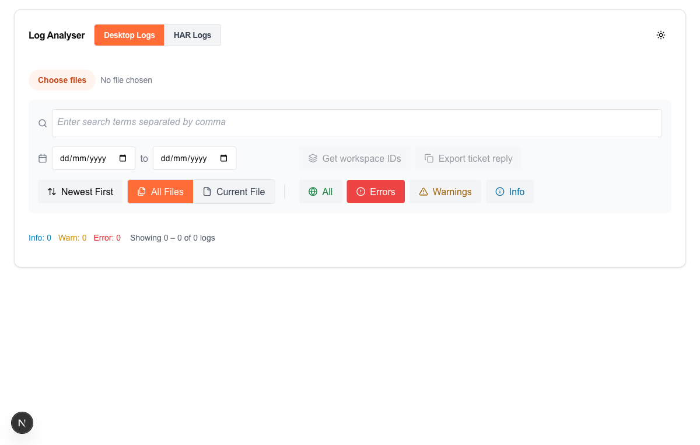
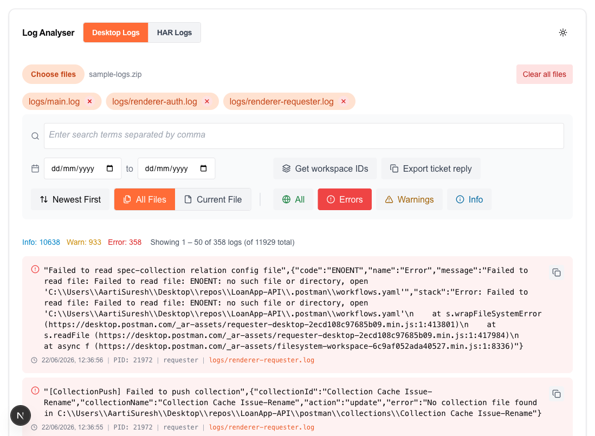
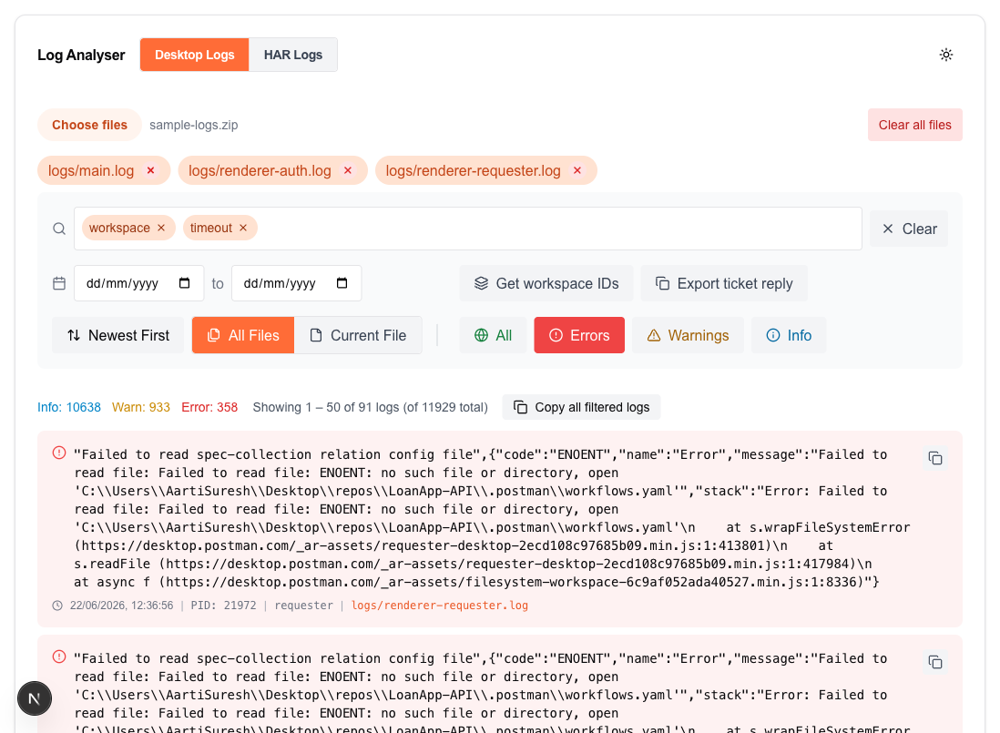
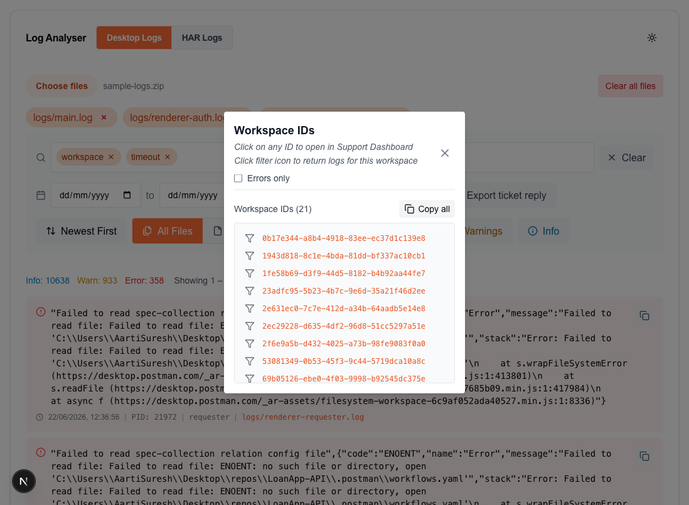
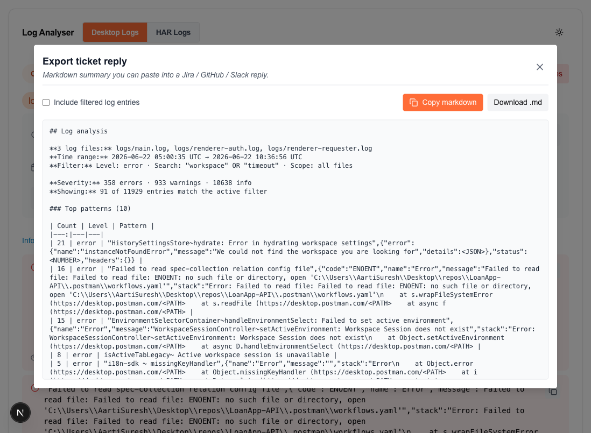

# LogAnalyzer — Onboarding Guide

A browser-based viewer for Postman Desktop log files (and HAR captures). It parses, filters, searches, and groups the noise so you can triage a support ticket in minutes instead of scrolling through tens of thousands of lines in a text editor.

---

## 1. How to access

LogAnalyzer is a Vercel-hosted web app — no install, no auth wall.

**URL:** <https://log-analyser-2.vercel.app/>

Works in any modern browser (Chrome, Firefox, Safari, Edge). All parsing happens in your browser — log files are never uploaded to a server, so you can drop in customer logs without worrying about data residency.

Bookmark it and you're done.

---

## 2. How to run an analysis

### 2.1 The empty state

When you open the page you'll see this:



Top bar:
- **Log Analyser** title.
- **Desktop Logs / HAR Logs** toggle — switch between two view modes. Default is Desktop.
- **Theme toggle** (top right) — light / dark mode.

The toolbar below is enabled but greyed out because there's nothing loaded. The two action buttons on the right (**Get workspace IDs**, **Export ticket reply**) light up once you upload files.

### 2.2 Upload your logs

Click **Choose files**. You can drop in any of:

| Format | What it expects |
|---|---|
| `.log` | A raw Postman Desktop log (the bracket-formatted one) |
| `.har` | An HTTP Archive capture (switch to **HAR Logs** view first) |
| `.zip` / `.rar` / `.7z` / `.tar` / `.gz` / `.tgz` / `.bz2` / `.xz` | Any archive containing the above — each entry is auto-extracted |

Multi-file uploads are supported. macOS `__MACOSX/` metadata and `.DS_Store` files inside archives are filtered out automatically.

Once parsed, you land on the default view: **Errors** filter active, newest entries first.



What's on screen:

- **File pills** at the top show every parsed file. Orange = currently included in scope. Click the red ⊗ to remove a file.
- **Stats line** (Info / Warn / Error counts + "Showing X of Y").
- **Log entries** — each one shows a severity icon, the message, timestamp, PID, context (the Postman subsystem that emitted it), and the source filename.

### 2.3 Narrow the result set

The toolbar has four ways to slice the logs:

1. **Level filter** — `All` / `Errors` / `Warnings` / `Info`. Click multiple levels at once to OR them together.
2. **Search tags** — type a term and press `Enter` or `,` to add it as a tag. Multiple tags are OR'd. Backspace on an empty input removes the last tag. Searches both message and context fields.
3. **Date range** — narrow by `YYYY-MM-DD` start / end. Either side optional.
4. **Scope** — `All Files` aggregates across every pill, `Current File` restricts to whichever pill is selected.



The stats line and entries update live as you change any filter. The "Showing N of M" caption tells you how aggressive your current filter is.

---

## 3. How to interpret the results

### 3.1 A log entry, line by line

Each card represents one parsed log line:

```
[icon] [message text]                                                   [copy]
       [clock] timestamp  |  PID: nnnn  |  context  |  source.log
```

| Visual | Meaning |
|---|---|
| 🔴 red circle + red-tinted bg | `[error]` level |
| 🟡 yellow triangle + yellow-tinted bg | `[warn]` level |
| 🔵 sky-blue ℹ icon + sky-tinted bg | `[info]` level |
| 🟢 green check / 🟠 orange / 🟡 amber / 🔵 blue circle | HAR view: maps to 2xx / 4xx / 3xx / 1xx HTTP status |
| Orange filename badge | The source file the line came from (visible when scope = All Files) |
| ⧉ copy button (top right of each card) | Copies the full line as plain text to clipboard |

### 3.2 The stats line at a glance

- **Info: N / Warn: N / Error: N** — totals across the *unfiltered* set (so you always know how loud the file is overall, even with filters applied).
- **Showing X – Y of N logs (of M total)** — X–Y is the current page, N is the filtered count, M is the unfiltered count.

A big gap between N and M usually means your filters are doing their job.

### 3.3 Pagination

50 entries per page. Use `‹‹ / ‹ / › / ››` to step, or type a page number into the **Go** input. Pagination resets when filters change.

---

## 4. Common workflows

### 4.1 "Customer reports a 500 — what happened?"

1. Drop their `.log` (or `logs.zip`) into **Choose files**.
2. Default filter is already **Errors** — you should see the failing requests near the top.
3. Add the failing endpoint or error keyword as a search tag to narrow further (e.g. `collections/get`).
4. Optionally add a date filter if you know roughly when the issue happened.
5. Click **Export ticket reply** (see §4.4) to paste a structured summary into the ticket.

### 4.2 "I need every workspace ID this customer's logs touched"

LogAnalyzer scans the (filtered or unfiltered, per **Scope** setting) log entries for any UUID that appears within 100 characters of the word "workspace".

1. Upload logs.
2. Click **Get workspace IDs**.



The modal opens with the full list. Each ID is:

- A clickable link to that workspace in **Support Dashboard** (opens in a new tab).
- Filterable — the small **filter** icon next to each ID adds it as a search tag on the main view, so you can immediately see every log line involving that workspace.
- **Errors only** checkbox — re-scans using only error-level entries, useful when a customer reports multiple workspaces are affected and you want to see which one is actually failing.
- **Copy all** — copies the list to clipboard (newline-separated) for pasting into a ticket or spreadsheet.

### 4.3 "I have a HAR capture from a customer's DevTools"

1. Toggle to **HAR Logs** at the top.
2. Click **Choose files** and pick the `.har` (or a zip containing `.har` files).
3. The filter row swaps to HTTP status buckets (`1xx / 2xx / 3xx / 4xx / 5xx / No response`) and a request timeline appears at the top. Click any bar in the timeline to drill into a single request.
4. Search tags work the same way — by URL substring, status, method, etc.

### 4.4 "Summarise this ticket reply for me"

Click **Export ticket reply**. A modal opens with a pre-formatted markdown block built from your current filtered view: file list, time range, severity counts, top patterns (after generalising UUIDs / timestamps / numbers), and any extracted workspace IDs.



- **Include filtered log entries** — toggles whether the full filtered log lines are embedded (capped at 50; a truncation note appears for larger sets).
- **Copy markdown** — clipboard.
- **Download .md** — saves a `.md` file named after the tab.

Paste straight into Jira / GitHub / Slack — tables, code blocks, and lists all render.

---

## 5. Troubleshooting tips

| Symptom | Why | Fix |
|---|---|---|
| "No file chosen" after upload | The zip contained only macOS metadata (`__MACOSX/`, `.DS_Store`) | Re-zip without the metadata, or upload the raw `.log` files directly |
| Log entries are missing or "0 logs" | Default filter is **Errors** — if you uploaded a clean run there may legitimately be none. Or your search tags excluded everything. | Switch the filter to **All**, or clear search tags with the **Clear** button next to the search box |
| **Get workspace IDs** returns nothing | The word "workspace" doesn't appear near any UUID in the (filtered) set. Check **Errors only** is off, and switch **Scope** to **All Files** | Try a wider scope; if still empty, the logs genuinely don't reference workspaces |
| Date range filter shows nothing | The dates are in `YYYY-MM-DD` and the logs may be in a different timezone. Try widening or removing the date filter | |
| Browser feels sluggish typing in search | Files in the multi-hundred-MB range can spike memory. Parsing runs in a Web Worker so the UI stays interactive, but you may want to filter to a single file via the **Current File** scope before adding tags | |
| Pattern in the export is too generic / too specific | The generaliser collapses UUIDs, timestamps, IPs, file paths, hashes, semver, JSON blobs, and 3+ digit numbers into placeholders. Anything outside those shapes appears verbatim | |

### Known limits

- LogAnalyzer expects the Postman Desktop log format (`[pid][timestamp][context][level][message]`). Lines that don't match are silently dropped — the parser will not parse arbitrary application logs.
- Workspace ID extraction only finds UUIDs preceded by the word "workspace" within ~100 characters. Other ID types (request IDs, collection IDs, etc.) aren't extracted.
- The pagination cap is hardcoded at 50 entries per page; very large filtered sets may take several pages to scroll through.

---

## Where to file feedback

- Bugs / feature requests: GitHub repo at <https://github.com/postmanEamon/Log-Analyser-2>.
